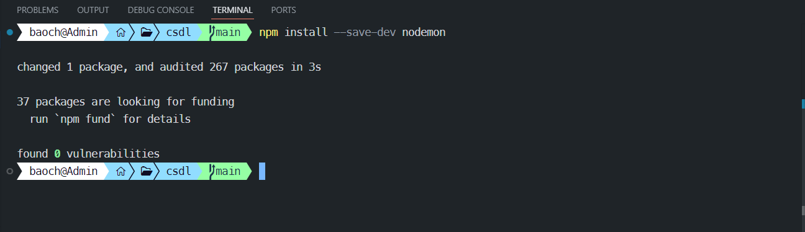

<h1 align="center">HƯỚNG DẪN SỬ DỤNG MÃ NGUỒN ĐỒ ÁN</h1>

# Bước 1: Cài đặt NodeJS
- Để cài đặt NodeJS ta cần tải NodeJS từ trang web https://nodejs.org/en/download về máy sau đó tiến hành cài đặt. Quy trình tải: Sau khi vào trang web đầu tiên ta chọn hệ điều hành sau đó chọn vào nút download phía bên dưới để tải về máy (Quy trình thực hiện như Hình 1).

Hình 1: Hướng dẫn tải NodeJS.

- Sau khi tải NodeJS về máy ta tiến hành cài đặt như bình thường. Sau khi cài đặt NodeJS ta cần kiểm tra xem NodeJS đã cài đặt thành công hay chưa bằng cách mở terminal và gõ "Node --version" nếu câu lệnh chạy thành công thì NodeJS đã được cài đặt trong máy còn bị lỗi thì phải tiến hành cài đặt lại(Quy trình thực hiện như Hình 2).

Hình 2: Kiểm tra NodeJS đã cài đặt thành công hay chưa.

# Bước 2: Tải mã nguồn từ Github về máy
Để tải mã nguồn đồ án từ github về máy ta cần sao chép đường dẫn của đồ án trên github là https://github.com/Chien2602/csdl_titanium.git sau chép đường dẫn ta cần vào thư mục muốn lưu mã nguồn sau đó trên thanh tìm kiếm ta gõ "powershell" để mở powershell. Tiếp theo ở powershell ta gõ "git clone https://github.com/Chien2602/csdl_titanium.git" (Quy trình thực hiện như Hình 3 và Hình 4).

Hình 3: Mở powershell từ thư mục muốn lưu mã nguồn.

Hình 4: Quá trình clone đồ án về máy.

*** Lưu ý: Để có thể clone đồ án từ github về máy thì cần phải cài đặt git trước. Để cài đặt git thì trước hết ta cũng cần tải git từ trang web https://git-scm.com/downloads sau khi tải git về máy thì ta tiến hành cài đặt git bình thường. Sau đó kiểm tra git cài đặt thành công hay chưa bằng cách gõ câu lệnh "git --version" trên terminal (Quy trình thực hiện như Hình 5, Hình 6 và Hình 7).

Hình 5: Chọn hệ điều hành của máy.

Hình 6: Chọn phiên bản của máy để cài đặt git (Ví dụ cho Windows).

Hình 7: Kiểm tra git cài đặt thành công hay chưa.

# Bước 3: Cài đặt các thư viện cần thiết
Mở terminal của Visual Studio Code sau đó gõ các câu lệnh sau để cài đặt thư viện:
- Chạy câu lệnh "npm init" để khởi tạo NodeJS trong dự án. Sau đó nhấn phím Enter đến hết (Như Hình 8).

Hình 8: Khởi tạo NodeJS.

- Chạy câu lệnh "npm install axios body-parser cors dotenv express mongoose msnodesqlv8 mssql pug" để cài đặt các thư viện cần thiết (Như Hình 9).

Hình 9: Cài đặt các thư viện cần thiết.

- Chạy câu lệnh "npm install --save-dev nodemon" để cài đặt thư viện nodemon nếu sau khi cài đặt mà nodemon bị lỗi thì có thể cài đặt lại bằng câu lệnh "npm install nodemon" (Như Hình 10).

Hình 10: Cài đặt thư viện nodemon.

# Bước 4: Chạy mã nguồn
Để chạy mã nguồn ta mở terminal trong Visual Studio Code và chạy câu lệnh "nodemon index" để chạy mã nguồn (Như Hình 11).

Hình 11: Chạy mã nguồn.

Sau khi chạy câu lệnh thành công ta cần vào trình duyệt web và chạy các đường dẫn sau sẽ dẫn đến các trang:
- http://localhost:3000/user (Trang người dùng)
- http://localhost:3000/admin (Trang quản trị viên)
- http://localhost:3000/employee (Trang nhân viên)
- http://localhost:3000/customer (Trang khách hàng)
- http://localhost:3000/product (Trang sản phẩm)
- http://localhost:3000/order (Trang hóa đơn bán hàng)
- http://localhost:3000/inventory (Trang hóa đơn nhập hàng)
- http://localhost:3000/supplier (Trang nhà cung cấp)
- http://localhost:3000/addUser (Trang thêm người dùng)
- http://localhost:3000/addProduct (Trang thêm sản phẩm)
- http://localhost:3000/addOrder (Trang thêm hóa đơn bán hàng)
- http://localhost:3000/addInventory (Trang thêm hóa đơn nhập hàng)
- http://localhost:3000/addSupplier (Trang thêm nhà cung cấp)

Các đường dẫn API:
- Trang người dùng:
+ GET: http://localhost:3000/usersRoute (Lấy tất cả người dùng)
       http://localhost:3000/usersRoute/id (Lấy người dùng theo id *id thay bằng id người dùng muốn lấy*)
+ POST: http://localhost:3000/usersRoute (Thêm người dùng)
+ PUT: http://localhost:3000/usersRoute/id (Cập nhật người dùng theo id *id thay bằng id người dùng muốn cập nhật*)
+ DELETE: http://localhost:3000/usersRoute/id (Xóa người dùng theo id *id thay bằng id người dùng muốn xóa*)

- Trang quản trị viên:
+ GET: http://localhost:3000/adminRoute (Lấy tất cả quản trị viên)
       http://localhost:3000/adminRoute/id (Lấy quản trị viên theo id *id thay bằng id quản trị viên muốn lấy*)
+ POST: http://localhost:3000/adminRoute (Thêm quản trị viên)
+ PUT: http://localhost:3000/adminRoute/id (Cập nhật quản trị viên theo id *id thay bằng id quản trị viên muốn cập nhật*)
+ DELETE: http://localhost:3000/adminRoute/id (Xóa quản trị viên theo id *id thay bằng id quản trị viên muốn xóa*)

- Trang nhân viên:
+ GET: http://localhost:3000/employeeRoute (Lấy tất cả nhân viên)
       http://localhost:3000/employeeRoute/id (Lấy nhân viên theo id *id thay bằng id nhân viên muốn lấy*)
+ POST: http://localhost:3000/employeeRoute (Thêm nhân viên)
+ PUT: http://localhost:3000/employeeRoute/id (Cập nhật nhân viên theo id *id thay bằng id nhân viên muốn cập nhật*)
+ DELETE: http://localhost:3000/employeeRoute/id (Xóa nhân viên theo id *id thay bằng id nhân viên muốn xóa*)

- Trang khách hàng:
+ GET: http://localhost:3000/customerRoute (Lấy tất cả khách hàng)
       http://localhost:3000/customerRoute/id (Lấy khách hàng theo id *id thay bằng id khách hàng muốn lấy*)
+ POST: http://localhost:3000/customerRoute (Thêm khách hàng)
+ PUT: http://localhost:3000/customerRoute/id (Cập nhật khách hàng theo id *id thay bằng id khách hàng muốn cập nhật*)
+ DELETE: http://localhost:3000/customerRoute/id (Xóa khách hàng theo id *id thay bằng id khách hàng muốn xóa*)

- Trang sản phẩm:
+ GET: http://localhost:3000/productRoute (Lấy tất cả sản phẩm)
       http://localhost:3000/productRoute/id (Lấy sản phẩm theo id *id thay bằng id sản phẩm muốn lấy*)
+ POST: http://localhost:3000/productRoute (Thêm sản phẩm)
+ PUT: http://localhost:3000/productRoute/id (Cập nhật sản phẩm theo id *id thay bằng id sản phẩm muốn cập nhật*)
+ DELETE: http://localhost:3000/productRoute/id (Xóa sản phẩm theo id *id thay bằng id sản phẩm muốn xóa*)

- Trang chi tiết sản phẩm:
+ GET: http://localhost:3000/product_infoRoute (Lấy tất cả sản phẩm)
       http://localhost:3000/product_infoRoute/id (Lấy sản phẩm theo id *id thay bằng id sản phẩm muốn lấy*)
+ POST: http://localhost:3000/product_infoRoute (Thêm sản phẩm *id sản phẩm phải tồn tại trong bảng PRODUCT*)
+ PUT: http://localhost:3000/product_infoRoute/id (Cập nhật sản phẩm theo id *id thay bằng id sản phẩm muốn cập nhật*)
+ DELETE: http://localhost:3000/product_infoRoute/id (Xóa sản phẩm theo id *id thay bằng id sản phẩm muốn xóa*)

- Trang hóa đơn bán hàng:
+ GET: http://localhost:3000/oderRoute (Lấy tất cả hóa đơn)
       http://localhost:3000/oderRoute/id (Lấy hóa đơn theo id *id thay bằng id hóa đơn muốn lấy*)
+ POST: http://localhost:3000/oderRoute (Thêm hóa đơn)
+ PUT: http://localhost:3000/oderRoute/id (Cập nhật hóa đơn theo id *id thay bằng id hóa đơn muốn cập nhật*)
+ DELETE: http://localhost:3000/oderRoute/id (Xóa hóa đơn theo id *id thay bằng id hóa đơn muốn xóa*)

- Trang chi tiết hóa đơn bán hàng:
+ GET: http://localhost:3000/oderItemRoute (Lấy tất cả hóa đơn)
       http://localhost:3000/oderItemRoute/id (Lấy hóa đơn theo id *id thay bằng id hóa đơn muốn lấy*)
+ POST: http://localhost:3000/oderItemRoute (Thêm hóa đơn *id hóa đơn phải tồn tại trong bảng ORDER*)
+ PUT: http://localhost:3000/oderItemRoute/id (Cập nhật hóa đơn theo id *id thay bằng id hóa đơn muốn cập nhật*)
+ DELETE: http://localhost:3000/oderItemRoute/id (Xóa hóa đơn theo id *id thay bằng id hóa đơn muốn xóa*)

- Trang hóa đơn nhập hàng:
+ GET: http://localhost:3000/inventoryRoute (Lấy tất cả hóa đơn)
       http://localhost:3000/inventoryRoute/id (Lấy hóa đơn theo id *id thay bằng id hóa đơn muốn lấy*)
+ POST: http://localhost:3000/inventoryRoute (Thêm hóa đơn)
+ PUT: http://localhost:3000/inventoryRoute/id (Cập nhật hóa đơn theo id *id thay bằng id hóa đơn muốn cập nhật*)
+ DELETE: http://localhost:3000/inventoryRoute/id (Xóa hóa đơn theo id *id thay bằng id hóa đơn muốn xóa*)

- Trang nhà cung cấp:
+ GET: http://localhost:3000/supplierRoute (Lấy tất cả nhà cung cấp)
       http://localhost:3000/supplierRoute/id (Lấy nhà cung cấp theo id *id thay bằng id nhà cung cấp muốn lấy*)
+ POST: http://localhost:3000/supplierRoute (Thêm nhà cung cấp)
+ PUT: http://localhost:3000/supplierRoute/id (Cập nhật nhà cung cấp theo id *id thay bằng id nhà cung cấp muốn cập nhật*)
+ DELETE: http://localhost:3000/supplierRoute/id (Xóa nhà cung cấp theo id *id thay bằng id nhà cung cấp muốn xóa*)

# Giải thích mã nguồn
Mã nguồn được chia ra các thư mục như sau:
- Thư mục connects: Chưa 2 file Mongodb.js là file kết nối đến MongoDB và file Sql.js là file kết nối đến SQL Server.
- Thư mục image: Chưa các file ảnh hướng dẫn sử dụng mã nguồn.
- Thư mục objects: Chứa các file code cơ sở dữ liệu hướng đối tượng.
- Thư mục pages: Chưa các module kết nối đến file pug.
- Thư mục routes: Chứa các file code API của các bảng trong cơ sở dữ liệu.
- Thư mục public: Chứa các thư mục con chứa file tĩnh như css, javascript và image.
- Thư mục views: Chứa giao diện các trang:
 + Thư mục partials: Chứa các file giao diện của header và footer.
 + File default.pug chứa giao diện mặc định của các trang.
 + Các file còn là giao diện của các trang.
- file .env: Chứa các thông tin kết nối đến cơ sở dữ liệu.
- file addData.py: Thêm dữ liệu từ SQL Server vào MongoDB.
- file index.js: Đây là file chính chứa các đường dẫn đến các file khác.